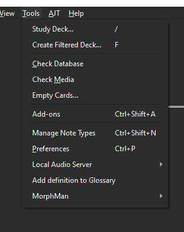

# Add-definitions-to-1T

This is an addon for Anki that I made because I wanted to add JMDICT definitions to every card with a "1T" tag.
It's intended to use with [Animecards](https://ankiweb.net/shared/info/151553357) and [MorphMan](https://ankiweb.net/shared/info/900801631).

## How to use



Just click in Tools and click add definitions to glossary.

## How to configure

```json
{
"max number of definitions": 10,
"source field": "Word",
"destination field": "Glossary",
"search": "-tag:mm_alreadyKnown tag:1T"
}
```

They are self-explanatory.
Change search for another [search](https://docs.ankiweb.net/searching.html) you want.
